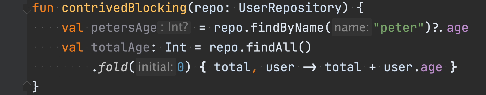
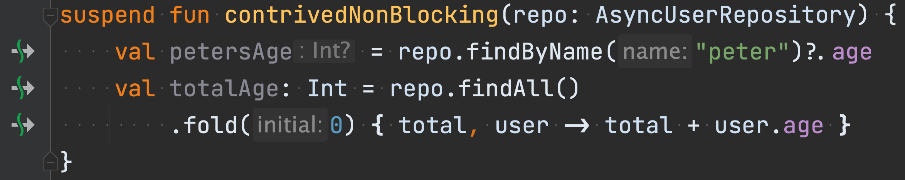

# IO

First-class citizen

Note: `interface Continuation<in T>`

----

# IO

Blocking

```kotlin
class UserRepository {
    fun findByName(name: String): User? = null
    fun findAll(): List<User> = emptyList()
}
```

----

# IO

Non-blocking

```kotlin
class UserRepository {
    suspend fun findByName(name: String): User? = null
    suspend fun findAll(): Flow<User> = emptyFlow()
}
```

Note: Regular values have the same behaviour as blocking IO.

----

# IO

Interaction




----

# IO

Granularity

```kotlin
val serverJob = launch(Dispatchers.IO) {
    for (received in serverSession.incoming) {
        clientSession.send(received) // blocking
    }
}

val clientJob = launch(Dispatchers.IO) {
    for (received in clientSession.incoming) {
        serverSession.send(received) // blocking
    }
}

joinAll(serverJob, clientJob)
```

Note:
Structured concurrency ensures no leaks

----

# IO

Cooperative cancellation

```kotlin
val serverJob = launch(Dispatchers.IO) {
    for (received in serverSession.incoming) {
        clientSession.send(received) // blocking
        yield() // Allow cancellation
    }
}

val checkJob = launch(Dispatchers.IO) {
    if (!contrivedService().checkEnabled()) {
        serverJob.cancel()
    }
}

joinAll(serverJob, checkJob)
```

----

# IO

Pitfalls

```kotlin
fun main() {
    println("foo")
}
```

Note:
Not enforced for all I/O
I.e. println performs blocking IO, yet is not suspend.

----

## IO

Context receivers as effect markers

```kotlin
fun interface Logger {
    fun log(msg: String)
}

context(Logger)
fun hello() {
    this@Logger.log("hello world!")
}

fun main() {
    with(Logger { msg -> println(msg) }) {
        hello()
    }
}
```

Note:
Context receivers can be used as dependency injection, dualling as effect markers, and in DSL builders.
`this@Logger` is optional
With great power...
